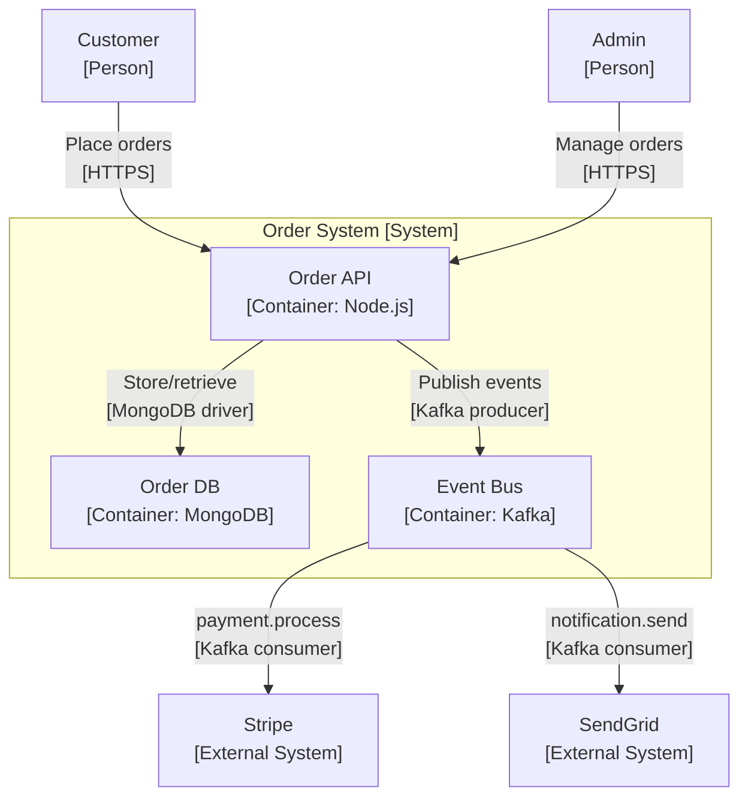

# Architecture Documentation

Mastery of this skill enables you to create, maintain, and audit architecture documentation that accurately reflects the real system — not an idealized version of it.

## When to Use This Skill
- Writing a new Architecture Decision Record (ADR)
- Auditing existing docs for staleness
- Creating C4 diagrams for a new system
- Writing a README or runbook from scratch
- Detecting documentation drift after a major refactor

## Core Concepts

### 1. ADR Format (Michael Nygard)
ADRs capture significant architectural decisions in a lightweight, searchable format. Write one when a decision is hard to reverse or affects multiple teams.

### 2. C4 Model Levels
| Level | Audience | Shows |
|-------|----------|-------|
| Context (L1) | Executives, stakeholders | System + users + external systems |
| Container (L2) | Developers, architects | Services, databases, queues |
| Component (L3) | Developers | Internal modules within a container |
| Code (L4) | Developers | Class diagrams (usually generated) |

### 3. Doc-Code Drift Signals
- Service mentioned in docs but directory doesn't exist
- API endpoint in docs but not in router files
- Database schema in docs has fields not in model files
- Technology stack in README differs from package.json
- Architecture diagram shows synchronous calls but code uses events

## Quick Reference
```bash
# Find all docs
find . -name "*.md" | grep -v node_modules | grep -v ".git"

# Detect service references in docs
grep -r "service\|microservice\|component" docs/ | grep -v ".git"

# Find undocumented API routes (Express example)
grep -r "router\.\(get\|post\|put\|patch\|delete\)" src/ | wc -l
# Compare against OpenAPI spec endpoint count

# Find schema fields not in docs
node -e "const m = require('./src/models/order'); console.log(Object.keys(m.schema.paths))"
```

## Key Patterns

### Pattern 1: ADR Template
```markdown
# ADR-0023: Adopt event-driven architecture for order processing

**Date**: 2026-01-15
**Status**: Accepted
**Deciders**: Technical Architect, VP Engineering, Platform Lead
**Tags**: architecture, messaging, kafka

## Context
Order processing involves 5 downstream services (inventory, payment, shipping, notifications, analytics).
Current synchronous REST chain causes:
- 3.2s average order completion time (target: < 1s)
- Cascading failures when any service is slow/down
- Tight coupling prevents independent deployments

## Decision
Replace synchronous service calls with event-driven architecture using Apache Kafka.
Each service subscribes to relevant topics and processes events asynchronously.

## Consequences

### Positive
- Order API responds in < 200ms (fire event, return order ID)
- Services fail and recover independently
- Event log enables replay, audit trail, and new consumers without coupling
- Teams can deploy services independently

### Negative
- Order status becomes eventually consistent (not immediately reflected)
- Operational complexity: Kafka cluster to manage (using MSK to reduce this)
- Debugging distributed flows is harder

### Neutral
- Consumer services must be idempotent (at-least-once delivery)
- Need distributed tracing (adding OpenTelemetry correlation IDs to events)

## Alternatives Considered
1. **gRPC with circuit breakers**: still synchronous coupling; partial improvement only
2. **AWS Step Functions**: good for orchestration but adds vendor lock-in and cost at scale

## References
- [PR #234: Initial Kafka infrastructure](https://github.com/...)
- [RFC: Event Schema Standards](docs/rfcs/event-schema-standards.md)
```

### Pattern 2: C4 Context Diagram (Mermaid)


### Pattern 3: README Template
```markdown
# Service Name

One sentence describing what this service does and who uses it.

## Quick Start
```bash
git clone ...
npm install
cp .env.example .env  # fill in required values
npm run dev           # starts on localhost:3000
```

## Configuration
| Variable | Required | Default | Description |
|----------|----------|---------|-------------|
| `DATABASE_URL` | Yes | — | MongoDB connection string |
| `JWT_SECRET` | Yes | — | 32+ char secret for JWT signing |
| `PORT` | No | 3000 | HTTP port |

## Key Commands
| Command | Description |
|---------|-------------|
| `npm run dev` | Start with hot reload |
| `npm test` | Run unit tests |
| `npm run test:e2e` | Run E2E tests (requires running services) |
| `npm run build` | Compile TypeScript |

## Architecture
See [Technical Design Document](docs/tdd-order-service.md) for full design.

## API Documentation
[OpenAPI Spec](docs/api/order-service.yaml) | [Local Swagger UI](http://localhost:3000/docs)
```

## Best Practices
1. ADRs are immutable — don't edit accepted ADRs; supersede them with a new one
2. Write ADRs during decision-making, not after implementation
3. C4 Context diagram first — it forces you to define system boundaries
4. README quick start should work from a fresh checkout in < 5 minutes
5. Link diagrams to code locations (e.g., `see src/handlers/` for API components)
6. Run architecture doc audit after every major refactor

## Common Issues
- **Stale ADR**: add `Superseded by ADR-NNN` to status; never delete
- **Diagram doesn't match code**: generate diagrams from code annotations where possible (use `@startuml` or Mermaid in code comments)
- **No one reads the docs**: colocate docs with code (`docs/` in each service repo, not a separate wiki)
